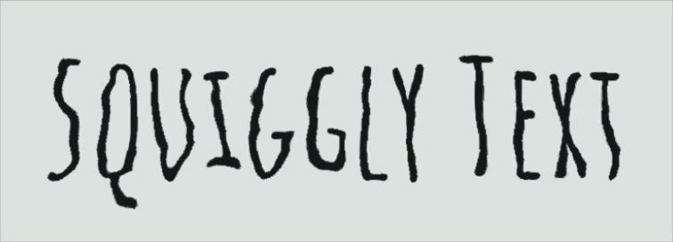

# flutter_squiggly_text

[](https://pub.dev/packages/flutter_squiggly_text)
[](https://pub.dev/packages/flutter_squiggly_text/score)
[](https://pub.dev/packages/flutter_squiggly_text/score)
[](https://pub.dev/packages/flutter_squiggly_text/score)
[](https://github.com/ortal83cohen/Flutter-Squiggly-Text/actions/workflows/platforms.yml)
[](https://pub.dev/packages/flutter_squiggly_text)
[](LICENSE)

Add a customizable squiggly underline to Flutter text, with optional animation
and pointer interaction.



Please [let us know about any problems](https://github.com/ortal83cohen/flutter_webmcp/issues/new/choose)
you encounter; we would be happy to improve the library together with the
community.

## Features

- Static or animated underlines with configurable amplitude, wavelength, gap,
	stroke width, color, gradient, speed, and phase.
- Ready-made `spellcheck` and `handwriting` styles. An explicit constructor
  argument overrides the matching preset field.
- Underlines follow each laid-out line, including centered, end-aligned, and
  right-to-left text.
- CodePen-style full-run glyph displacement that preserves shaping, including
  combining marks, ligatures, RTL text, and emoji sequences.
- Pointer interactions for highlighting, shrinking, enlarging, trembling a letter
  or word, lifting, repelling, and magnetically pulling nearby letters.
- Keyboard-focus activation through `hoverOnly` when interaction is configured.
- Standard Flutter text layout options, including wrapping, alignment,
	overflow, maximum lines, strut styles, locales, and text direction.
- Accessibility semantics with an optional custom label.
- Reduced-motion support enabled by default.

## Installation

Add the package to your `pubspec.yaml`:

```yaml
dependencies:
  flutter_squiggly_text: ^0.1.0
```

## Usage

```dart
import 'package:flutter_squiggly_text/flutter_squiggly_text.dart';

const SquigglyText(
  'Hello Flutter',
  style: TextStyle(fontSize: 24, fontWeight: FontWeight.bold),
  squiggleColor: Colors.deepOrange,
  amplitude: 3,
  wavelength: 10,
)
```

`SquigglyText` supports regular Flutter text styling, wrapping, alignment,
maximum lines, and custom accessibility labels.

Set `hoverPreview: true` when a showcase needs to display a pointer effect
without waiting for pointer input. The effect is centered on the text until
the pointer enters the widget.

Use `hoverScope` with `SquigglyHoverScope.all`, `.word`, or `.letter` to
control the region affected by pointer interaction. `trembleLetter` and
`trembleWord` always use their named region, regardless of `hoverScope`.
Keyboard focus supplies a centered interaction target. Explicit `hoverPreview`
also activates `hoverOnly`, so a preview does not wait for a real pointer.

Animation is static by default. To enable the initial animated underline wave:

```dart
const SquigglyText(
  'Hello Flutter',
  animationStyle: SquigglyAnimationStyle.wave,
  speed: 1,
)
```

Use `SquigglyAnimationStyle.letters` to tremble the painted text in place, or
`SquigglyAnimationStyle.waveAndLetters` to combine that displacement with the
underline. Letter displacement scales with font size using a shared turbulence
field; `amplitude` remains an underline-only setting. Animation parameters are
validated.

`speed: 0` pauses time-based motion while configured static pointer effects
remain available. `fluidity` adjusts lift and magnetic strength; `stagger` is
reserved and currently has no visual effect.

`respectReducedMotion` defaults to `true` so platform reduced-motion
preferences disable the internal ticker and pointer response.

Pointer interaction can be enabled with `hoverBehavior` and `hoverRadius`:

```dart
const SquigglyText(
  'Hover me',
  animationStyle: SquigglyAnimationStyle.waveAndLetters,
  hoverBehavior: SquigglyHoverBehavior.liftLetters,
  hoverRadius: 56,
)
```

Available behaviors include `shrink`, `enlarge`, `trembleLetter`, `trembleWord`,
`repel`, `liftLetters`, and `magnetic`. The selected scope controls the
affected region. When animation is enabled, `hoverOnly` waits for pointer input or
keyboard focus. Configured interaction participates
in keyboard focus traversal; the default static widget does not request focus.

Set `pauseWhenNotVisible` to pause automatic animation while the app is
inactive or paused. This is an app-lifecycle signal, not viewport visibility
detection.

`phase` is an offset in turns. The default `0` keeps widgets that share a
`speed` in lockstep. It shifts the underline wave and, when `speed` is
positive, the letter shader. Negative turns are allowed. `speed: 0` does not
start motion, so a phase value stays unused until animation is running.

`squiggleGradient` paints the underline stroke along each laid-out line. A
null gradient keeps the solid `squiggleColor`. Glyph color stays on `style`.

```dart
const SquigglyText(
  'Hello Flutter',
  animationStyle: SquigglyAnimationStyle.wave,
  squiggleGradient: LinearGradient(colors: [Colors.red, Colors.orange]),
  phase: 0.25,
)
```

`SquigglyTextStyle.spellcheck` is a red static underline with the library
geometry defaults. `SquigglyTextStyle.handwriting` animates letters in place,
with amplitude `0` and speed `1`, and draws no underline.

```dart
const SquigglyText(
  'teh',
  squiggleStyle: SquigglyTextStyle.spellcheck,
)

const SquigglyText(
  'Hello Flutter',
  squiggleStyle: SquigglyTextStyle.handwriting,
  speed: 1.5,
)
```

Styled fields resolve in this order: an explicit constructor argument, then
the matching non-null preset field, then the library default. A null argument
is not explicit. In the handwriting sample above, `speed: 1.5` replaces the
preset speed, and amplitude stays `0`.

## API overview

The main public API is the `SquigglyText` widget:

| Option | Purpose |
| --- | --- |
| `style` and `squiggleColor` | Configure text and underline appearance. |
| `squiggleGradient` | Paints the underline stroke with a gradient along each laid-out line. Null keeps the solid `squiggleColor`. |
| `amplitude`, `wavelength`, `strokeWidth`, and `gap` | Configure underline geometry. |
| `animationStyle`, `speed`, `phase`, `fluidity`, and `stagger` | Configure animation. `speed` controls wave cycles per second and the letter displacement cadence. `phase` is an offset in turns and defaults to 0. `speed: 0` leaves `phase` unused. |
| `squiggleStyle` | Applies `SquigglyTextStyle.spellcheck` or `SquigglyTextStyle.handwriting`, or a custom `SquigglyTextStyle`. Explicit constructor arguments win over preset fields. |
| `hoverBehavior`, `hoverRadius`, `hoverOnly`, `hoverScope`, and `hoverPreview` | Configure pointer, focus, range, and preview interaction. |
| `respectReducedMotion` and `pauseWhenNotVisible` | Control when animation runs. |
| `semanticsLabel` | Provide an alternative accessibility label. |

See the generated API documentation for the complete constructor and property
reference.

## Example application

The looping preview at the top of this README shows the example app without
opening a video player. The [`example/`](example/) directory contains the
interactive preview with Amatic SC, glyph displacement, underline geometry,
color, wrapping, right-to-left text, and accessibility semantics.

```shell
cd example
flutter pub get
flutter run
```

## Supported platforms

This package is implemented entirely with Flutter's cross-platform rendering
APIs and has no platform-specific plugins or native dependencies. It supports
all Flutter application targets:

- Android
- iOS
- Web
- Windows
- macOS
- Linux

The example application can be used on every supported Flutter target.

## License

This package is available under the MIT License.
